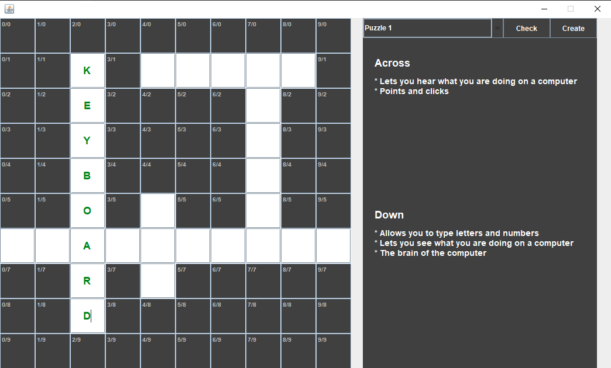

# CrosswordPuzzle-Java
A simple GUI version Cross-Word puzzle game.\
future scope:- new Puzzles
 
### Languages & tools :

  

|My Age Calculation |
|------|
||

### Directory Structure :
    |-- out
    |-- src
    |   |-- com
    |       |-- crossword
    |           |-- Main.java
    |          
    |-- crosswordPuzzle-Java.iml
    |
    |-- Img
    |   |-- intellij.png
    |   |-- java.png
    |   |-- crosswordPuzzleJava.png
    |
    |-- README.md

